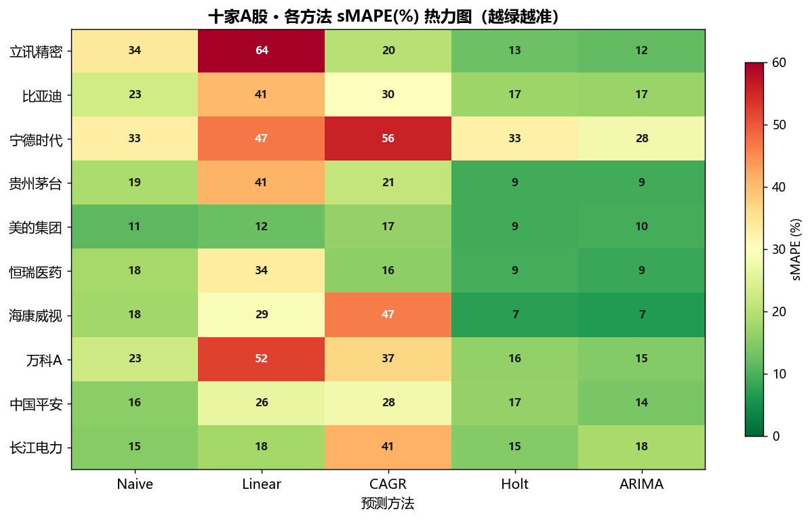
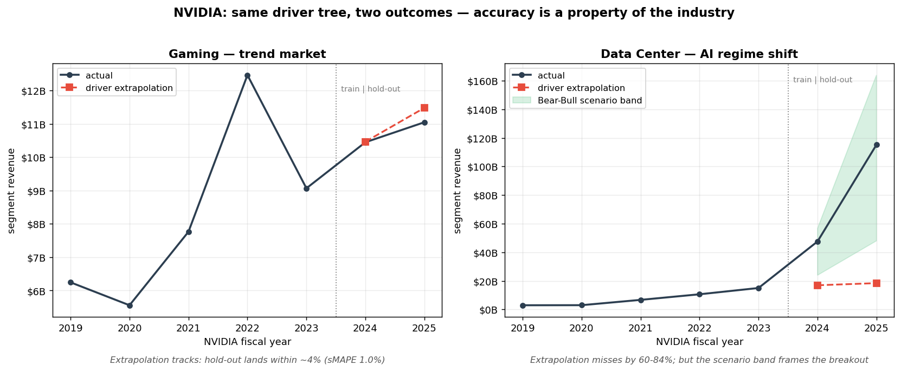

# revenue-model-builder

[](https://github.com/ljftwq-dev/revenue-model-builder/actions/workflows/ci.yml)
[](https://opensource.org/licenses/MIT)
[](https://www.python.org/downloads/)
[](#安装)

**English: [README.md](README.md)**

一个**自下而上的收入预测框架**——把 driver tree
（`市场基数 × 渗透率 × 市占率 × 单价`）变成**可审计**的收入模型，通过一条
结构性的差额行（residual）对齐到年报总收入。核心引擎**零第三方依赖**（纯 Python 标准库），
蒙特卡洛 + 敏感度分析层也是。

设计上编码了五条踩过坑才总结出的建模铁律（详见
[设计原则白皮书](docs/design-principles.md)）：**结构性差额行**、**ABC 数据等级**、
**增量法**、**确定性金字塔**、**先历史后预测**。

---

## 为什么需要它

市面上的开源金融工具，要么是**交易/回测**（zipline、backtrader、QuantLib），要么是
**DCF 估值**。而卖方分析师、PE 投资经理真正在做的 **driver-based 收入拆解预测**
（把收入拆成 `基数 × 渗透率 × 市占率 × 单价`），几乎没有开源实现。

最接近的是给 AI agent 用的 TAM/SAM/SOM **prompt skill**（如 `slgoodrich/agents`、
`deanpeters/Product-Manager-Skills`）——它们用自然语言描述方法论，但**没有一个是能跑的引擎**。
本项目就是：把工作流用代码固化、数学由引擎强制执行，而不是交给一段 prompt。

一份卖方收入模型，成败在于你能不能**为每一个数字辩护**——"这个渗透率哪来的？为什么不能再
高点？" 手工 Excel 用晦涩的批注回答。`revenue-model-builder` 把它做成结构化的：每个 driver
自带可信度等级和来源，差额行是一等公民，对齐校验会在"反推渗透率"污染预测期之前就拦住。

## 与同类对比

| | revenue-model-builder | market-sizing SKILL | DCF 估值库 |
|---|---|---|---|
| 可运行的代码引擎 | ✅ | ❌ 仅 prompt | ✅ |
| 聚焦点 | 收入拆解 | 市场容量 (TAM/SAM/SOM) | 内在价值 |
| 对齐年报总收入（差额行）| ✅ 结构性 | ❌ | 不适用 |
| 每个数字 ABC 分级 | ✅ | ❌ | ❌ |
| 不确定性（蒙特卡洛 + tornado）| ✅ | ❌ | 部分有 |
| 核心依赖 | **零** | 不适用 | 通常 numpy + 数据 API |

## 核心公式

```
分项收入 = 市场基数 × 渗透率 × 市占率 × 单价
总收入   = Σ(分项) + 差额行          # 差额行吸收未建模业务
```

单位推导：基数（百万辆）× 单价（元）= **百万元**（渗透率、市占率是 [0,1] 的小数）。
所以 `Segment.revenue()` 按定义返回百万元。

## 安装

```bash
pip install -e .                  # 仅核心引擎（纯标准库，零依赖）
pip install -e ".[excel]"         # + openpyxl，用于输出 .xlsx
pip install -e ".[dev]"           # + pytest，用于跑测试
pip install -e ".[backtest]"      # + statsmodels，用于 Holt/ARIMA 回测
```

## 快速上手

**建模型并校验是否对齐年报总收入：**

```python
from revenue_model import Driver, Segment, RevenueModel, BASE, PENETRATION, SHARE, PRICE

seg = Segment(
    name="舱内-国内",
    base=Driver("中国乘用车销量", BASE, {2022: 22.0, 2023: 23.0},
                level="A", unit="百万辆", source="CAAM"),
    penetration=Driver("DMS 前装渗透率", PENETRATION, {2022: 0.04, 2023: 0.06},
                       level="B", unit="小数", source="高工产业研究院"),
    share=Driver("市占率", SHARE, {2022: 0.10, 2023: 0.12},
                 level="C", unit="小数", source="估算"),
    price=Driver("单价", PRICE, {2022: 600, 2023: 620},
                 level="C", unit="元", source="对标"),
)
model = RevenueModel("DemoCo", [seg], total_revenue={2022: 110.0, 2023: 215.0})

for r in model.validate_all():
    print(r.year, f"分项合计={r.segment_sum:.1f}", f"差额={r.residual:.1f}",
          f"({r.residual_ratio:.0%})", r.warnings)
```

**跑虚构公司 demo**（NovaTech，车载 AI 公司，所有数据均为虚构）：

```bash
python -m revenue_model.demo
```

**渲染成带格式的 .xlsx**（需 `[excel]` extra）：

```bash
python -m revenue_model.excel_builder 输出.xlsx
```

## 蒙特卡洛 + 敏感度

把单点预测变成**分布**，并找出**哪个假设最关键**——纯标准库，不用 numpy：

```python
from revenue_model import simulate_model, tornado

# 收入分布：对不确定的 driver 采样、相乘、重复
mc = simulate_model(model, 2024, {
    "市占率": (0.10, 0.18),          # C 级，区间宽
    "单价": (620, 680),
}, n=20000, seed=0)
print(mc.median, mc.percentiles["p5"], mc.percentiles["p95"])   # P5/中位/P95

# Tornado：用每个 driver 各自的区间（不是统一 %）→ 排序摆动
for it in tornado(seg, 2024, {
    "中国乘用车销量": (23.5, 24.5),          # A 级，区间窄
    "DMS 前装渗透率": (0.07, 0.12),          # B 级
    "市占率": (0.10, 0.18),                  # C 级，区间宽
    "单价": (620, 680),
}):
    print(f"{it.driver:20s} swing {it.swing:.1f}")
```

> **为什么用每个 driver 各自的区间，而不是统一 ±%？** 收入是个**乘积**
> （`基数 × 渗透 × 市占 × 单价`），对每个因子用相同的百分比扰动，会得到**完全相同的摆动**——
> tornado 毫无区分度。只有当每个区间反映该 driver 的真实不确定性（A 级硬数据窄、C 级估算宽），
> tornado 才有意义。（这也正是 ABC 分级与敏感度分析相互印证的地方。）

## 回测

一份收入预测到底准不准？`backtest` extra 用**诚实的样本外评估**回答——
用历史拟合、预测下一年、滑动窗口前进，绝不让方法看到它要预测的那个值。

五种方法正面交锋：**Naive**（随机游走，要击败的基准）、**Linear** 趋势、
**CAGR**（对数线性/恒定增速）、**Holt** 指数平滑、**ARIMA**。纯标准库指标
（`sMAPE` / `MAPE` / `MAE` / `RMSE` / R² / 方向命中率）；`sMAPE` 是主指标，因为它在
体量差异极大的公司间依然稳健。Naive/Linear/CAGR 零依赖；Holt/ARIMA 惰性导入 statsmodels。

```python
from revenue_model.backtest import (
    Naive, LinearTrend, LogLinearCAGR, HoltLinear, ARIMA,
    rolling_backtest, evaluate, score_table,
)

steps = rolling_backtest(
    years, values,
    [Naive(), LinearTrend(), LogLinearCAGR(), HoltLinear(), ARIMA()],
    min_train=8, horizon=1)
print(score_table(evaluate(steps)))
```

真实 A 股数据通过 `data` extra（akshare）加载，缓存为 CSV 保证可复现。
**十家公司覆盖六种增长模式**：

| 方法 | 平均 sMAPE | 最优次数 (10 家中) |
|---|---|---|
| **Holt / ARIMA**（自适应） | **~14%** | **10 / 10** |
| Naive | 21% | 0 |
| Linear / CAGR（固定趋势） | 36% / 31% | 0 |



> **这对框架本身的启示。** 在收入**总量**层面，自适应统计方法碾压固定趋势——
> 高成长股是指数级增长，线性拟合会系统性低估，连**方向**都判错。所以 **driver 分解**
> 的价值**不在于"把总量猜得更准"**（统计方法做得更好），而在于**定位结构**：哪块业务
> 靠趋势、哪块靠一次性事件（如立讯 2025 年收购 Leoni——任何总量方法都看不见）。精度
> 与可解释性是互补，不是替代。见 [`examples/backtest_demo/`](examples/backtest_demo/)。

## NVIDIA demo —— driver tree 在哪准、在哪崩

第一个**美股** demo。NVIDIA 是一个刻意的"双面测试"：**同一公司、同一套
`base × penetration × share × price` 公式、同一引擎**——Gaming hold-out
**sMAPE 1.0%**（成熟趋势市场）vs Data Center **60%**（AI 范式跳变；FY2025 真实
$115.2B vs 预测 $18.4B）。demo 接着闭环：用 Monte Carlo 情景分布的 Bull 尾把
真实爆发框住——点预测崩了，但情景带兜住了真相。



> 准确性是**行业**的属性，不是模型的属性。见
> [`examples/nvda_demo/`](examples/nvda_demo/) 与旗舰方法论文档
> [`docs/industry-fit-analysis.md`](docs/industry-fit-analysis.md)——行业适配性矩阵、
> 事件驱动增长的五招、以及为什么本库选择诚实而非虚假精度。

## 主营业务抽取（从年报）

把 segment build-up 里最繁琐的部分自动化——用 LLM 从年报「主营业务分析」文本里抽出
**segment 骨架**（业务线、收入、占比、YoY、毛利率、driver_type 标签、driver 线索）。纯标准库
HTTP（无 SDK）；LLM 调用可注入，测试/CI 不需要 API key。

```python
from revenue_model import extract_segments, alignment_check

# text = 「主营业务分析」章节文本（上游用 PyMuPDF 从年报 PDF 抽取）
parsed = extract_segments(text, api_key="<your-llm-key>")   # 经 secrets 管理器加载
print(parsed["segments"])                                   # segment 骨架列表
print(alignment_check(parsed))                             # Σ + 差额 ≈ 年报总收入
```

输出 schema 见 [docs/proposal-segment-extraction.md](docs/proposal-segment-extraction.md) §4。
填入 driver 的**具体数值**（C 级估算）仍是人工步骤——见提案的半自动边界（§7）。
**专有/非公开的
公司数据不入库**；真实公司 demo（立讯、NVIDIA）只用公开披露数据（见
[DISCLAIMER.md](DISCLAIMER.md)）。虚构的 NovaTech 是零真实数据的默认示例。

## 五条设计原则

| # | 原则 | 防止什么 |
|---|---|---|
| 1 | **差额行是结构性设计，绝不反推** | 为了"对齐"而抬高渗透率，污染预测期 |
| 2 | **ABC 数据等级** | 黑箱表格——让每个数字可追溯 |
| 3 | **渗透率用增量法，不用增速法** | 有界变量指数爆炸 |
| 4 | **预测确定性金字塔** | 把所有输入当成同样可知 |
| 5 | **先历史后预测** | 模型还没复现历史就开始预测未来 |

外加验证层（三角验证、假设文档化、S 曲线）：**[docs/design-principles.md](docs/design-principles.md)**。

## API

```python
Driver(name, kind, values, level="C", unit="", source="")
#   kind ∈ {BASE, PENETRATION, SHARE, PRICE};  level ∈ {"A","B","C"}

Segment(name, base, penetration, share, price)
#   .revenue(year) -> float  (百万元)

implied_driver(segment, year, target_revenue, solve_kind) -> float
#   把某个 driver 对齐到已知收入（如年报分项收入）；优先解 PRICE/BASE，避免解 PENETRATION（反推陷阱）

RevenueModel(company, segments, total_revenue)
#   .validate(year)  -> YearResult   (分项收入、差额、告警)
#   .validate_all()  -> list[YearResult]

simulate_segment(segment, year, ranges, n=10000, seed=0) -> MCResult
simulate_model(model, year, ranges, n=10000, seed=0)     -> MCResult
#   ranges: {driver名: (low, high)};  MCResult 含 mean/median/stdev/percentiles

tornado(segment, year, ranges) -> list[SensitivityItem]   # 按 swing 排序

scenarios(mc, *, bear_p=0.10, bull_p=0.90) -> list[Scenario]  # 从分布切片 Bear/Base/Bull

extract_segments(text, *, api_key=None, llm=None) -> dict  # 从年报抽 segment 骨架
alignment_check(parsed) -> dict                            # Σ + 差额 ≈ 年报总收入
```

## 目录结构

```
revenue-model-builder/
├── revenue_model/
│   ├── driver.py        # Driver — 单个因子（基数/渗透/市占/单价）+ ABC 等级
│   ├── segment.py       # Segment — 收入 = 基数 × 渗透 × 市占 × 单价
│   ├── model.py         # RevenueModel — 差额行 + 对齐校验
│   ├── monte_carlo.py   # 收入分布 + tornado 敏感度（纯标准库）
│   ├── extractor.py     # 年报文本 → segment 骨架（LLM，纯标准库）
│   ├── excel_builder.py # 渲染成 .xlsx（ABC 颜色、IF 公式、差额行）
│   ├── backtest/        # 样本外回测（metrics / methods / rolling / data）
│   └── demo.py          # NovaTech 虚构示例
├── tests/               # 102 个测试 — 公式、校验、差额、蒙特卡洛、tornado、抽取、回测
├── docs/
│   └── design-principles.md
└── pyproject.toml
```

## 路线图

- [x] 蒙特卡洛收入分布 + 敏感度（tornado）分析
- [x] 从年报文本抽 segment 骨架（LLM）
- [x] driver 外推 API（增量法 / logistic / 趋势拟合）
- [ ] driver 数值估算（C 级，来自行业数据）
- [x] Bear / Base / Bull 情景（从蒙特卡洛分布切片）
- [ ] 多市场数据源适配器（A股 tushare / 美股 yfinance / 港股）
- [ ] 从年报文本自动抽取 driver
- [ ] Word 底稿生成器（历史 + 预测叙述）
- [x] PyPI 发布
- [x] 可视化图表（分布 / 龙卷风 / 瀑布 / 历史+预测趋势）
- [x] 交互式 Streamlit app（driver 滑块 → 图实时变）
- [x] 回测 — 样本外方法对比（Naive / Linear / CAGR / Holt / ARIMA）

## 适用人群

卖方研究、PE/VC 投资团队、股票分析师，以及正在学基本面分析的同学——想要一个
**可复用、可审计**的收入建模脚手架，而不是每次都手工重建同样的 Excel 结构。

## 许可证与免责声明

MIT — 见 [LICENSE](LICENSE)。本项目是**研究/教育工具，非投资建议**——完整声明见
[DISCLAIMER.md](DISCLAIMER.md)。
