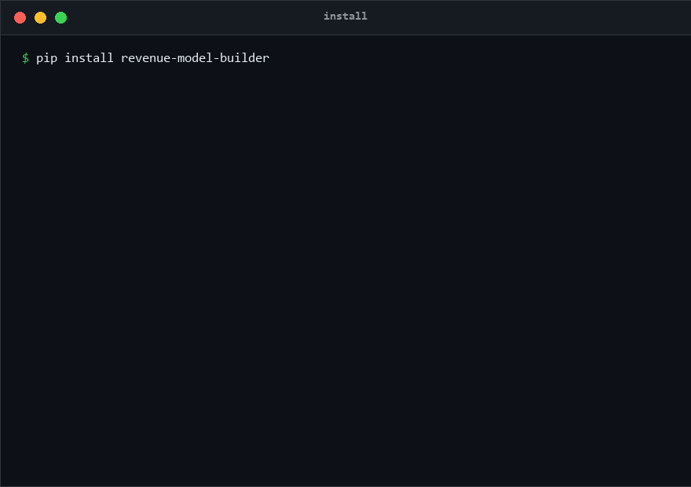

<div align="center">


# revenue-model-builder

**Forecast revenue the way sell-side analysts do — as a driver tree the
engine can defend, grade, and stress-test.**

[](https://github.com/ljftwq-dev/revenue-model-builder/actions/workflows/ci.yml)
[](https://ljftwq-dev.github.io/revenue-model-builder/)
[](https://pypi.org/project/revenue-model-builder/)
[](https://pypi.org/project/revenue-model-builder/)
[](https://www.python.org/downloads/)
[](#install)
[](LICENSE)

中文文档：[README-zh.md](README-zh.md)



*Zero dependencies. Pure stdlib Monte Carlo. Every number carries a source
and a credibility grade.*

`segment_revenue = market_base × penetration × share × price`
`total_revenue  = Σ(segments) + residual`

</div>

---

> ### Pre-registered, out-of-sample validated
>
> The v0.16 industry-fit claim was tested on **244 S&P 500 constituents**
> (anti-survivorship anchor 2023-12-31) + six hand-built driver trees, per a
> spec frozen before any test data was pulled:
>
> - **Driver layer**: industry-default forecasts beat naive per-driver
>   trending on 3 of 4 testable trees (SBUX **0.7%** vs 3.6%, META 4.6% vs
>   6.7%, NVDA Gaming **3.0%** vs 10.9% sMAPE)
> - **Weak-fit redirect works**: warnings fired **2/2** with **0/4** false
>   alarms, and Monte Carlo P10–P90 bands framed all three weak-fit test
>   years (JPM NII landed at P46; NVDA Data Center at P75/P66)
> - **Honest nulls published**: growth-revert falsified at home; totals
>   layer belongs to statistical baselines
>
> Full scorecard: [docs/profile-validation.md](docs/profile-validation.md)

## Why this exists

Open-source finance tooling covers trading and backtesting
(zipline, QuantLib) and DCF valuation — but **driver-based revenue
forecasting**, the `base × penetration × share × price` decomposition that
sell-side analysts and PE associates actually build in Excel, has no
runnable engine. Prompt skills describe the method; this library *is* the
method — the math enforced in code, not left to a spreadsheet comment.

A revenue model lives or dies on whether you can defend every number.
Here every driver carries a **credibility grade (A/B/C)** and a source, the
**residual is a first-class line** (not a fudge), and checks catch the
classic traps — back-solved penetration, residual dominance — before they
poison the forecast.

| | revenue-model-builder | market-sizing prompt skills | DCF libs |
|---|---|---|---|
| Runnable engine | ✅ | ❌ prompt only | ✅ |
| Industry-aware defaults (10 profiles) | ✅ | ❌ | ❌ |
| Aligns to reported totals (structural residual) | ✅ | ❌ | n/a |
| A/B/C grading per number | ✅ | ❌ | ❌ |
| Uncertainty (MC + tornado, pure stdlib) | ✅ | ❌ | sometimes |
| Core dependency footprint | **0** | n/a | usually numpy + API |

## One image: where driver trees work — and where they break


Same company, same formula, same engine — **Gaming** (mature market) tracks
at **1.0% sMAPE** while **Data Center** (AI regime shift) misses 6× *and
the engine flags it before the hold-out opens*, redirecting to Monte Carlo
scenarios whose Bull tail frames the actual $115B. Accuracy is a property
of the industry's growth mechanism — v0.16 encodes that as 10 mechanism
profiles with strong/adapt/weak fit classes ([validated out-of-sample](
docs/profile-validation.md)).

## 60-second start

```bash
pip install revenue-model-builder
```

```python
from revenue_model import (
    Driver, Segment, RevenueModel, BASE, PENETRATION, SHARE, PRICE,
    forecast_segment, segment_warnings, simulate_segment,
)

seg = Segment(
    "cockpit-domestic",
    base=Driver("China passenger car sales", BASE, {2022: 22.0, 2023: 23.0},
                level="A", unit="M units", source="CAAM"),
    penetration=Driver("DMS penetration", PENETRATION, {2022: 0.04, 2023: 0.06},
                       level="B", unit="fraction", source="research institute"),
    share=Driver("market share", SHARE, {2022: 0.10, 2023: 0.12},
                 level="C", unit="fraction", source="estimate"),
    price=Driver("ASP", PRICE, {2022: 600, 2023: 620},
                 level="C", unit="yuan", source="benchmark"),
    industry="consumer_electronics",   # <- the one tag that changes everything
)
model = RevenueModel("DemoCo", [seg], total_revenue={2022: 78.0, 2023: 163.0})

print(model.validate_all())               # Σ segments + residual == reported
fc = forecast_segment(seg, [2024, 2025])  # industry-default extrapolations
for w in segment_warnings(fc):            # fit verdict, before you forecast
    print(w)
mc = simulate_segment(fc, 2024, {"market share": (0.10, 0.18)}, n=20000)
print(mc.median, mc.percentiles["p5"], mc.percentiles["p95"])
```

Or watch the GIF above. CLI: `python -m revenue_model {build, simulate, excel, docx, extract, sec, akshare, tushare}`.

## What's inside

| Feature | Benefit |
|---|---|
| **Driver-tree core** (pure stdlib, zero deps) | Auditable `base × penetration × share × price` with A/B/C grades and sources — no black box |
| **Structural residual** | Segments align to reported totals; the un-modeled remainder is visible, not hidden |
| **10 industry profiles** (v0.16) | Tag `industry=` and get analyst-first defaults, industry checks, and weak-fit scenario redirects — soft defaults, hand overrides always win |
| **Monte Carlo + tornado** | Per-driver uncertainty bands (not uniform %); find which assumption actually moves revenue — pure stdlib |
| **Honest backtesting** | Out-of-sample sMAPE across Naive/Linear/CAGR/Holt/ARIMA + profile-implied shape methods; the [validation report](docs/profile-validation.md) publishes its nulls |
| **Data adapters** (optional extras) | SEC EDGAR / A-share tushare / HK akshare / Q4 IR PDFs — pull real filings into driver histories |
| **Excel / Word output** | Model workbook with formulas; methodology memo with charts |
| **LLM segment extraction** | Annual-report text → segment skeletons (injectable LLM, tests need no key) |

### Deep dives (each links to docs + runnable example)

- **Industry fit** — the matrix, NVDA/Luxun natural experiments →
  [docs](docs/industry-fit-analysis.md) ·
  [examples/industry_demo](examples/industry_demo/)
- **Profile validation** — the pre-registered 244-company test →
  [docs](docs/profile-validation.md) ·
  [examples/profile_validation](examples/profile_validation/)
- **News-impact validation** — do 8-K events predict revenue? (spoiler: no,
  and that's the finding) → [docs](docs/news-impact-validation.md)
- **Backtest** — adaptive methods vs driver structure on real data →
  [examples/backtest_demo](examples/backtest_demo/)
- **Real-data demos** — NVDA (SEC, quarterly granularity),
  Luxun/Desay SV (A-share 20-year), zhipu ARR ladder →

  [examples/](examples/)

## Install

Core is dependency-free; extras opt in:

```bash
pip install revenue-model-builder                 # core, zero deps
pip install revenue-model-builder[excel]          # openpyxl
pip install revenue-model-builder[docx]           # python-docx + matplotlib
pip install revenue-model-builder[backtest,data]  # statsmodels + akshare
```

Python 3.9–3.13 · MIT license ·
[Documentation](https://ljftwq-dev.github.io/revenue-model-builder/) ·
[Changelog](CHANGELOG.md)

## Design principles

Five hard-won rules, enforced structurally: structural residual · A/B/C
data grading · incremental (not growth-rate) penetration · certainty
pyramid · history-first workflow →
[docs/design-principles.md](docs/design-principles.md)

*Research/education tool, not investment advice — see
[DISCLAIMER](DISCLAIMER).*

## Roadmap

- **v0.18 (data anchor)**: Damodaran industry benchmarks wired into
  profile checks — thresholds become citations
- **v0.19 (experience)**: profile auto-recommendation from backtest
  fingerprints; profile catalog page

**Shipped — v0.17 (math kernel)**: churn-survival dynamics for
subscription bases (`base × (1+gross) − base × churn` as the saas/telecom
default, with a net-churn check that no ARPU escalator offsets a shrinking
base); DampedTrend + DeceleratingCAGR graduated from the pre-registered
validation into the standard backtest battery (7 methods); hand-coverage
fix in `forecast_segment`; G1 code gate in CI (ruff, pinned ruleset +
mypy on the kernel); FIG teaching-consensus citations for the weak-fit
financials class.

Full history: [CHANGELOG.md](CHANGELOG.md) ·
[Releases](https://github.com/ljftwq-dev/revenue-model-builder/releases)

## Who is this for

Sell-side/PE associates who want their revenue model to be code; quants
researching forecastability by industry mechanism; students learning
driver-based valuation; FP&A teams escaping spreadsheet sprawl.
Contributions welcome — the [docs](docs/) double as the design record.

<details>
<summary><b>API at a glance</b> (click to expand)</summary>

```python
from revenue_model import (
    Driver, Segment, RevenueModel,            # core tree
    BASE, PENETRATION, SHARE, PRICE,          # driver kinds
    implied_driver,                           # calibrate one driver to a known
                                              # revenue (prefer PRICE/BASE over
                                              # PENETRATION: avoids back-solve)
    forecast_segment, segment_warnings,       # industry defaults + checks
    check_segment, list_profiles, resolve_industry,
    simulate_model, simulate_segment, scenarios,   # Monte Carlo
    tornado,                                  # per-driver sensitivity ranking
)
# Driver extrapolations: trend (fit_trend), mean_reversion, erosion, growth,
# hold, logistic, incremental — and net_growth (v0.17): subscriber bases as
# base x (1+gross) - base x churn, the two knobs kept separate.

# Driver(name, kind, {year: value}, level="A"|"B"|"C", unit=..., source=...)
# Segment(name, base=..., penetration=..., share=..., price=...,
#         reported_revenue={...}, industry="saas_subscription" | "40" | "银行")
# Segment.revenue(year) -> float
# RevenueModel.validate_all() -> [YearResult(segment_sum, residual, warnings)]
# CLI: python -m revenue_model {build, simulate, excel, docx, extract,
#                               sec, akshare, tushare}
```

Layout: `revenue_model/` (engine) · `docs/` (methodology + validation
reports) · `examples/` (NVDA, Luxun, industry demo, profile validation,
backtest, ARR ladders) · tests (303, pure-stdlib CI).

</details>
